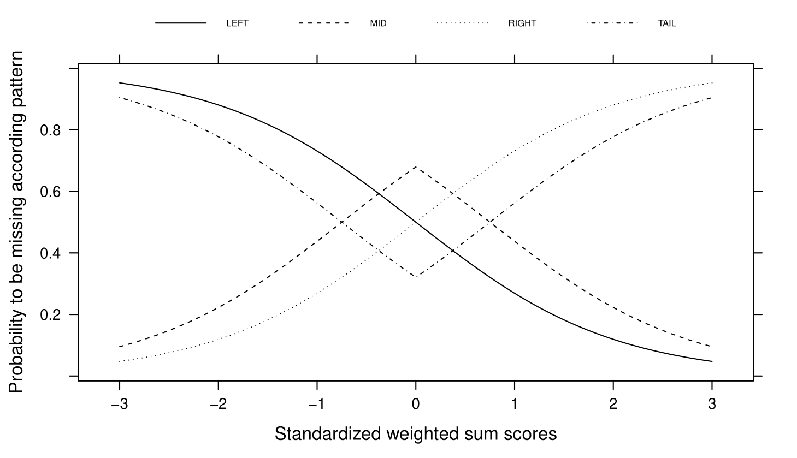

A mapping from R-function ``ampute`` to ``pyampute``
====================================================

Amputation of complete datasets is important for evaluating the effect of missing values on the outcome of a model. A methodology for multivariate amputation has been proposed by [Schouten2018]_ and has been implemented in R-function ``ampute`` in package ``mice``. Since then, it is used by many (see [Schouten2021]_ for an example).

With ``pyampute``, we now provide the same amputation methodology for Python users, and we do more. Compared to ``ampute``, the input parameters of ``pyampute`` are more intuitive and easier to specify. 

In this blogpost, we serve two purposes: 

1. For R users who want to switch to ``pyampute``, we provide a mapping from the input parameters of ``ampute`` to those of ``pyampute``. 
2. For Python users, we give a more in-depth explanation of how ``pyampute`` can be used to generate any desired form of missing data. 

In general, multivariate amputation follows :download:`this scheme <figures/scheme.pdf>`. Specifically for ``ampute``, a detailed explanation of the input parameters is provided in a `vignette`_. Note that for ``pyampute``, a short explanation of the input parameters is provided in the documentation: :class:`~pyampute.ampute.MultivariateAmputation`.

.. _vignette: https://rianneschouten.github.io/mice_ampute/vignette/ampute.html
.. _mice: https://github.com/amices/mice
.. _documentation: https://rianneschouten.github.io/pyampute/build/html/pyampute.ampute.html

The fundament: patterns
-----------------------

Key in multivariate amputation is the specification of missing data patterns. A missing data pattern is a combination of missing values on certain variables and observed values on the other variables. It can be very helpful to know what missing data patterns occur in your dataset, since these may bring to light underlying issues in data collection or preprocessing.

In ``pyampute``, an overview of missing data patterns in an incomplete dataset can be obtained with :class:`~pyampute.exploration.md_patterns.mdPatterns`. For instance, the `nhanes2`_ dataset contains 4 missing data patterns:

.. code-block:: python

    from pyampute.exploration.md_patterns import mdPatterns 
    mdp = mdPatterns()
    mypatterns = mdp.get_patterns(nhanes2)

.. figure:: figures/mdpatterns_nhanes2.png
    :width: 400px
    :align: center
    :alt: alternate text
    :figclass: align-center

    Missing data patterns in incomplete dataset `nhanes2`_

Here, blue and red correspond to observed and missing values respectively. The numbers on the left specify the number of rows in the dataset that follow a particular missing data pattern. For instance, there are 3 rows with observed values on variables `age`, `hyp` and `bmi` and a missing value on variable `chl`. 

Combinations other than the ones you see in the plot do not exist in the dataset. For instance, there are no rows with observed values on `age` and `hyp` and missing values on `bmi` and `chl`. 

The multivariate amputation methodology depends on the specification of these missing data patterns. Per pattern, you decide the missing data mechanism, the frequency, the weights of the variables that determine where the missing values should occur and the missingness type. Considering all of this, the input parameters of ``ampute`` and ``pyampute`` roughly differ as follows.

.. topic:: Main difference in input between ``ampute`` and ``pyampute``

    In ``ampute``, the patterns, mechanisms, weights, frequencies and types are specified as distinct parameters. That means that all these parameters should have matching sizes. For instance, the first row in the patterns matrix should correspond to the first row in the weights matrix, and to the first value in the frequency vector, etcetera.

    In ``pyampute``, we specify one dictionary per pattern. In that dictionary, information about the mechanism, weights, frequency and type can be specified. The idea is that it is easy to add and remove patterns, and you have the freedom to choose default settings for some patterns while specifying others. 

Let's discuss in more detail.

.. _nhanes2: https://github.com/RianneSchouten/pymice/tree/master/data

The patterns matrix in ``ampute``
*********************************

In ``ampute``, patterns are specified with a binary matrix of size :math:`k` by :math:`m` where :math:`k` indicates the number of patterns and :math:`m` indicates the number of variables. A cell in the patterns matrix equals ``0`` if a variable should be amputed and ``1`` otherwise.

The patterns matrix of `nhanes2`_ would look as follows:

.. math::

    patterns = \begin{bmatrix}
            1 & 1 & 1 & 0 \\
            1 & 1 & 0 & 0 \\
            1 & 0 & 0 & 1 \\
            1 & 0 & 0 & 0
        \end{bmatrix}

Without further specification, by default ``ampute`` generates a number of patterns that is equal to the number of variables in the dataset. Then, in every pattern, just one variable is amputed. For instance, if we would ampute a complete version of `nhanes2`_, the default patterns matrix in ``ampute`` would be:

.. math::

    default = \begin{bmatrix}
            0 & 1 & 1 & 1 \\
            1 & 0 & 1 & 1 \\
            1 & 1 & 0 & 1 \\
            1 & 1 & 1 & 0
        \end{bmatrix}

.. _nhanes2: https://github.com/RianneSchouten/pymice/tree/master/data

Specifying patterns in ``pyampute``
***********************************

As noted before, in ``pyampute`` we make all our choices per pattern. In case of multiple patterns, the input is a list of dictionaries. For `nhanes2`_, that would mean:

.. code-block:: python

    from pyampute.ampute import MultivariateAmputation 
    ma = MultivariateAmputation(
        patterns = [
            {'incomplete_vars': [3]},
            {'incomplete_vars': [2]},
            {'incomplete_vars': [1,2]},
            {'incomplete_vars': [1,2,3]}
        ]
    )
    nhanes2_incomplete = ma.fit_transform(nhanes2_complete)

This may seem cumbersome at first, but it will allow for easy modification of just one of the patterns while keeping the others intact. We will further discuss this when talking about mechanisms, weights, frequency and types. 

In ``pyampute``, we have furthermore improved the default patterns setting. Here, we generate one (instead of :math:`m`) missing data pattern, and in that pattern we randomly ampute 50% of the variables (instead of 1 per pattern). We expect that the new default will be a better fit with the amputation purposes of most users.

Proportion and frequency
------------------------

Naturally, specifying the proportion of missing values is an important part of any amputation process. In multivariate amputation (see [Schouten2018]_), we control that proportion with two input arguments:

1. ``prop`` determines the proportion of incomplete data rows
2. ``freq`` determines how those incomplete rows are divided over the :math:`k` patterns.

Proportion and frequency in ``ampute``
**************************************

In ``ampute``, ``prop`` is one value (a float, or integer) and ``freq`` is a vector of length :math:`k`. Then, ``prop = 0.3`` indicates that 30% of the rows should be amputed. And ``freq = c(0.1, 0.1, 0.2, 0.6)`` would indicate that 10% of those incomplete rows should have pattern 1, 10% should have pattern 2, 20% should have pattern 3 and 60% should have pattern 4. In other words, for a dataset with :math:`n` rows, :math:`0.1 \cdot 0.3 \cdot n` rows will be amputed with pattern 1. 

Proportion and frequency in ``pyampute``
****************************************

In ``pyampute``, the definitions of proportion and frequency are very similar to those in ``ampute``. The only difference is that ``prop`` is a global input parameter, whereas ``freq`` is specified per pattern. Therefore, ``freq`` has to be specified within the dictionaries. That could look as follows:

.. code-block:: python

    ma = ampute.MultivariateAmputation(
        patterns = [
            {'incomplete_vars': [3], 'freq': 0.1},
            {'incomplete_vars': [2], 'freq': 0.1},
            {'incomplete_vars': [1,2], 'freq': 0.2},
            {'incomplete_vars': [1,2,3], 'freq': 0.6}
        ],
        prop = 0.3
    )

It is important to realize that all incomplete rows should be amputed with at least one of the patterns, and therefore the frequency values should sum to 1. By default, all patterns are created with equal frequency.   

Missing data mechanisms
-----------------------

In missing data theory, we categorize missing data problems into three categories (cf. [Rubin1976]_). Roughly: 

1. Data is Missing Completely At Random (MCAR) if the probability of being incomplete is the same for every row in the dataset.
2. Data is Missing At Random (MAR) if the probability of being incomplete depends on observed values (i.e. if the information about the missing values is in the observed data).
3. Data is Missing Not At Random (MNAR) if the probability of being incomplete is unobserved. This could mean that the missingness probability depends on the missing value itself, or it could mean that the probability depends on a source outside the data. 

The outcome of your model and the extent to which certain missing data methods may or may not be useful greatly relies on whether you assume data to be MCAR, MAR or MNAR. For instance, in case of MAR, observed data can be used to infer about the missing values (for example using imputation methods or maximum likelihood estimation), but with MNAR that may be more difficult. In [Schouten2021]_, we provide a thorough discussion of this topic. 

Mechanisms in ``ampute``
************************

In ``ampute``, missing data mechanisms are defined by means of one string or a vector of strings. In case of a vector, the number of strings should equal the number of patterns (such as the number of rows in the patterns matrix, and the number of frequency values). For instance, ``mech = "MAR"`` or ``mech = c("MAR", "MCAR", "MAR", "MNAR")`` (for four patterns).

Mechanisms in ``pyampute``
**************************

In ``pyampute``, we specify the mechanism with a string per pattern. Here, it is not necessary to define a mechanism for every pattern. If left open, the MAR default will be used. 

.. code-block:: python

    ma = ampute.MultivariateAmputation(
        patterns = [
            {'incomplete_vars': [3], 'mechanism': "MCAR"},
            {'incomplete_vars': [2]},
            {'incomplete_vars': [1,2], 'mechanism': "MNAR"},
            {'incomplete_vars': [1,2,3]}
        ]
    )

The missing data mechanisms are strongly related to the concept of *weighted sum scores*, which we will discuss in the next section. The choices for a MCAR, MAR or MNAR mechanism will therefore be translated into a default set of weights. One may also want to determine a custom set of weights, which could create another form of MAR or MNAR missingness. In that case, the mechanism does not have to explicitly be specified.

In ``pyampute``, there is the possibility to let the mechanism be a mixture of MAR and MNAR missingness. For such a pattern, weights *have to* be provided. Let's discuss these weights in more detail.

Weighted sum scores: weights
----------------------------

In multivariate amputation, we not only control which variables will be incomplete (by means of missingness patterns), but we also control where the information about these missing values is. As said before, such control is important since it influences the extent to which certain missing data methods may or may not work. 

Whether or not a data row is amputed is determined by the combination of a weighted sum score and a probability distribution. For row :math:`i` in :math:`\{1,2,...,n\}`, a weighted sum score is calculated as follows:

.. math::

    wss_i = w_1 y_{i1} + w_2 y_{i2} + ... + w_m y_{1m},

where :math:`w_j` is the weight for variable :math:`y_j` with :math:`j` in :math:`\{1,2,...,m\}`. The idea is that by specifying some nonzero weights and letting others be 0, we have control over what part of the dataset contains the information about the missing values. 

For instance, let's say that we specify the following pattern with the following weights for variables `age`, `hyp`, `bmi` and `chl`;

.. math::

    pattern = [0, 1, 1, 1]

.. math::

    weights = [0, 0, 1, 2]

This means that we ampute variable `age` using the information in variables `bmi` and `chl`. Because the weight of `chl` is twice as large as the weight of `bmi`, `chl`'s impact on the amputation is twice as large as well. Therefore, `chl` has a more important role in a imputation method (or other missing data method) than `bmi`. In contrast, `hyp` is not weighted nor amputed, and therefore plays a minimal role (although a strong correlation with `bmi` or `chl` may still be beneficial, see [Schouten2021]_).

By default, a MAR mechanism translates into weights of ``0`` for the incomplete variables and weights of ``1`` for the complete variables. For MNAR, weights of ``0`` are given to the complete variables and ``1`` to the incomplete variables. In other words, by default, all variables in a weighted sum score are `equally` weighted.

With a MCAR mechanism, weights are not important and data rows will receive a weighted sum score of `0`.

Weights in ``ampute``
*********************

In ``ampute``, weights are specified in a matrix that has the same size as the patterns matrix: :math:`k` by :math:`m`. In other words, the weights for the first pattern are specified in the first row of the weights matrix, the weights for the second pattern in the second row, etcetera. 

Weights in ``pyampute``
***********************

In ``pyampute``, weights are defined per pattern. That gives the flexibility to manually define weights for some patterns, but use the default settings for other patterns. Weights can be specified using an array or a dictionary.

For instance, we could do the following:

.. code-block:: python

    import numpy as np

    mean = [5,5,5,5]
    cor = 0.5
    cov = [[1,cor,cor,cor],[cor,1,cor,cor,],[cor,cor,1,cor],[cor,cor,cor,1]]
    n = 1000
    rng = np.random.default_rng()
    compl_dataset = rng.multivariate_normal(mean, cov, n)
    
    ma = MultivariateAmputation(
        patterns = [
            {'incomplete_vars': [3], 'weights': [0,4,1,0]},
            {'incomplete_vars': [2]},
            {'incomplete_vars': [1,2], 'mechanism': "MNAR"},
            {'incomplete_vars': [1,2,3], 'weights': {0:-2,3:1}, 'mechanism': "MAR+MNAR"}
        ]
    )

    incompl_dataset = ma.fit_transform(compl_dataset)

Here, for the first pattern, we specify weights using an array. Nonzero weights are given to the variables `hyp` and `bmi`. Since both these variables are not amputed (only the variable at position 3 is amputed), these weights will result in a MAR mechanism.

For the second pattern, we do not specify weights nor a mechanism. Consequently, the default MAR mechanism is chosen with default settings for weights. Considering that the variable at position 2 is amputed, this means that variables `age`, `hyp` and `chl` are weighted: ``[1,1,0,1]``.

For the third pattern, we choose a MNAR mechanism and do not specify weights. Considering that variables `hyp` and `chl` are amputed, by default, MNAR results in the following weights: ``[0,1,1,0]``.

For the fourth pattern, we specify weights using a dictionary. Here, variables `age` and `chl` are weighted (as indicated by the dictionary keys). Since variable `age` is not amputed, and variable `chl` is amputed, these weights correspond to a mixture of MAR and MNAR. This should be specified with the ``mechanism`` parameter.

Note that negative weights can be given as well. Note furthermore that in order for the weights to make sense:

1. the existence and extent of correlation between variables is extremely important, see [Schouten2021]_,
2. the influence of variables should be equal for equal weights. Therefore, by default, parameter ``std = True`` ensures that the data is standardized before calculating weighted sum scores. 

You can inspect the final weights and their effect on the weighted sum scores as follows. The weights can be obtained with ``ma.weights``, which will result in:

.. math::

    weights = \begin{bmatrix}
            0 & 4 & 1 & 0 \\
            1 & 1 & 0 & 1 \\
            0 & 1 & 1 & 0 \\
            -2 & 0 & 0 & 1
        \end{bmatrix}

Weighted sum scores are stored in ``ma.wss_per_pattern``, which gives a list of :math:`k` arrays. Attribute ``ma.assigned_group_number`` indicates the assignment of rows to patterns. Then, plotting weighted sum scores against the dataset values will help to further understand the effect of the parameter settings.

.. code-block:: python

    from scipy import stats

    std_data = stats.zscore(compl_dataset)
    is_incomplete = np.where(np.isnan(incompl_dataset), 'incompl', 'compl')

    # variable `hyp` against the weighted sum scores in pattern 1
    df0 = pd.DataFrame(dict(x=std_data[ma.assigned_group_number == 0,1],
                            y=ma.wss_per_pattern[0],
                            label=is_incomplete[ma.assigned_group_number == 0,3]))

    # variable `age` against the scores in pattern 4
    df3 = pd.DataFrame(dict(x=std_data[ma.assigned_group_number == 3,0],
                            y=ma.wss_per_pattern[3],
                            label=is_incomplete[ma.assigned_group_number == 3,1]))

    fig, ax = plt.subplots(nrows=1, ncols=2, figsize=(8,4))
    for name, group in df0.groupby('label'):
        ax[0].plot(group.x, group.y, marker='o', linestyle='', ms=5, label=name)
    for name, group in df3.groupby('label'):
        ax[1].plot(group.x, group.y, marker='o', linestyle='', ms=5, label=name)
    plt.show()

.. figure:: figures/wss_plots.png
    :width: 600px
    :align: center
    :alt: alternate text
    :figclass: align-center

Missingness types and score_to_probability_func
-----------------------------------------------

At this point in the amputation process, all rows in the dataset are assigned to a pattern and have a weighted sum score. We now reach the state where we decide which rows will be amputed. We do that by means of a probability function that maps the weighted sum scores to a probability of being amputed. The multivariate amputation methodology knows four types of probability functions.

Types in ``ampute``
*******************

In R-function ``ampute``, for each pattern one of these four types of probability functions can be chosen. You specify your choice using a string or a vector of strings of length :math`k`, similar like ``mech``. For instance, ``type = "RIGHT"`` will assign high probabilities to rows with high weighted sum scores in every pattern. And ``type = c("LEFT", "RIGHT", "MID", "TAIL")`` will assign high probabilities to low, high, average or extreme weighted sum scores in patterns 1 to 4 respectively. 

Score_to_probability_func in ``pyampute``
*****************************************

In ``pyampute``, we renamed the parameter to ``score_to_probability_func`` to clarify the meaning of the input. Again, a probability function can be chosen per pattern and is indicated in the dictionary.

In addition, ``pyampute`` allows for the specification of a custom probability function. This can be any function that maps values in the range :math:`[-inf,inf] \rightarrow [0,1]`. We demonstrate the possibilities of these custom probability functions in the example `Amputing with a custom probability function`_.

.. _Amputing with a custom probability function: https://rianneschouten.github.io/pyampute/build/html/auto_examples/plot_custom_probability_function.html

Conclusion
----------

In sum, with :class:`~pyampute.ampute.MultivariateAmputation` in Python package ``pyampute`` we allow for easy, multivariate amputation of complete datasets. 

Read more in `Evaluating missing values with grid search and a pipeline`_ and `A custom pipeline with more possibilities`_ to learn how to design an experimental pipeline for evaluating the effect of missing values. 

Note furthermore that ``pyampute`` comes with :class:`~pyampute.exploration.md_patterns.mdPatterns`, which allows for a quick inspection of an incomplete dataset, and with :class:`~pyampute.exploration.mcar_statistical_tests.McarTest`, an implementation of [Little1988]_ MCAR test, although it should be used with care. 

Please do not hesitate to `contact us`_ in case there are any questions.

Cheers,

.. _`Evaluating missing values with grid search and a pipeline`: https://rianneschouten.github.io/pyampute/build/html/auto_examples/plot_simulation_pipeline.html
.. _`A custom pipeline with more possibilities`: https://rianneschouten.github.io/pyampute/build/html/auto_examples/plot_custom_pipeline.html
.. _contact us: https://rianneschouten.github.io/pyampute/build/html/about.html

References
----------

.. [Schouten2021] Schouten, R.M. and Vink, G. (2021) The dance of the mechanisms: How observed information influences the validity of missingness assumptions. `Sociological Methods & Research,` 50(3): 1243-1258.
.. [Schouten2018] Rianne R.M., Lugtig, P. & Vink, G. (2018) Generating missing values for simulation purposes: A multivariate amputation procedure. `Journal of Statistical Computation and Simulation,` 88(15): 1909-1930. 
.. [Little1988] Little, R. J. A. (1988). A test of missing completely at random for multivariate data with missing values. `Journal of the American Statistical Association,` 83(404), 1198–1202.
.. [Rubin1976] Rubin, D. B. (1976) Inference and Missing Data. `Biometrika,` 63 (3): 581–90.