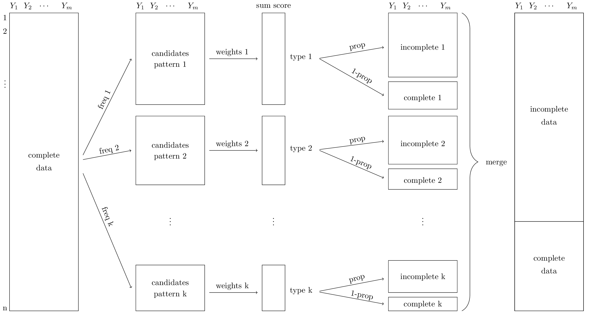

A mapping from R-function ``ampute`` to ``pyampute``
====================================================

.. contents:: Overview
    :depth: 3

Multivariate amputation has been proposed by [Schouten2018]_ and implemented in function ``ampute`` in statistical language ``R`` in package ``mice``. Since then, the amputation methodology has been used and cited by many. 

With ``pyampute``, we now provide the same methodology for Python users, and more. Compared to ``ampute``, the input arguments of ``pyampute`` are more intuitive and faster to specify. A quick explanation of ``pyampute``'s arguments can be found in the `documentation`_. 

For the R-function, a detailed explanation of how the multivariate amputation methodology relates to the input arguments is provided in a `vignette`_. This blogpost therefore has two purposes: 

1. For R users, we provide a mapping from the input arguments of ``ampute`` to those of ``pyampute``. 
2. For Python users, we further explain how the input arguments of ``pyampute`` can be used to generate any desired form of missing data. 

.. _vignette: https://rianneschouten.github.io/mice_ampute/vignette/ampute.html
.. _mice: https://github.com/amices/mice
.. _documentation: https://rianneschouten.github.io/pymice/build/html/pymice.amputation.html

The fundament: patterns
-----------------------

Key in multivariate amputation is the specification of missing data patterns. A missing data pattern is a combination of missing values on certain variables and observed values on the other variables. Knowing the missing data patterns in an incomplete dataset can be very helpful for understanding possible explanations for the occurrence of those missing values. 

In ``pyampute``, an overview of missing data patterns in an incomplete dataset can be obtained with class ``mdPatterns``. For instance, the `nhanes2`_ dataset has 4 missing data patterns:

.. code-block:: python

    import pyampute.md_patterns as mp 
    mypat = mp.mdPatterns()
    mdpatterns = mypat.get_patterns(nhanes2)

.. figure:: figures/mdpatterns_nhanes2.png
    :width: 200px
    :align: center
    :alt: alternate text
    :figclass: align-center

    Missing data patterns of incomplete dataset nhanes2

Here, blue and red correspond to observed and missing values respectively. The numbers on the left indicate the number of rows in the dataset that follow a specific missing data pattern. For instance, there are 3 rows with observed values on variables age, hyp and bmi and a missing value on variable chl. In this dataset, there are no rows with observed values on age and hyp and missing values on bmi and chl. That combination does not exist. 

All aspects of multivariate amputation are connected to the missingness patterns. Per pattern, one decides the missing data mechanism, the frequency, the weights of the variables that guide the amputation and the missingness type. Considering this, the input arguments of ``ampute`` and ``pyampute`` differ as follows.

.. topic:: Difference between ``ampute`` and ``pyampute``

    In ``ampute``, the patterns, mechanisms, weights, frequencies and types are defined in distinct arguments, and they should all describe the same number of patterns. For instance, the first row in the patterns matrix should correspond to the first row in the weights matrix, and to the first value in the frequency vector, etcetera.

    In ``pyampute``, one specifies one dictionary per pattern. That dictionary contains information about the pattern and the corresponding mechanism, weights, frequency and type. One can then easily add or remove patterns.

Let's discuss in more detail.

.. _nhanes2: https://github.com/RianneSchouten/pymice/tree/master/data

The patterns matrix in ``ampute``
*********************************

In ``ampute``, patterns are specified with a binary matrix of size :math:`k` by :math:`m` where :math:`k` indicates the number of patterns and :math:`m` indicates the number of variables. A cell in the patterns matrix equals ``0`` if in that patterns variable :math:`m` should be amputed and ``1`` otherwise.

The patterns matrix of `nhanes2`_ would look as follows:

.. math::

    patterns = \begin{bmatrix}
            1 & 1 & 1 & 0 \\
            1 & 1 & 0 & 0 \\
            1 & 0 & 0 & 1 \\
            1 & 0 & 0 & 0
        \end{bmatrix}

Without further specification, by default ``ampute`` generates the number of patterns equal to the number of variables in the dataset. Then, in every pattern, just one variable is amputed. For instance, if we would ampute a complete version of nhanes2, the default patterns matrix in ``ampute`` would be:

.. math::

    default = \begin{bmatrix}
            0 & 1 & 1 & 1 \\
            1 & 0 & 1 & 1 \\
            1 & 1 & 0 & 1 \\
            1 & 1 & 1 & 0
        \end{bmatrix}

.. _nhanes2: https://github.com/RianneSchouten/pymice/tree/master/data

Specifying patterns in ``pyampute``
***********************************

As noted before, in ``pyampute`` we make all specifications per pattern. In case of multiple patterns, the user specifies a list of dictionaries. For `nhanes2`_, the input would be:

.. code-block:: python

    import pyampute as ampute 
    mads = ampute.MultivariateAmputation(
        patterns = [
            {'incomplete_vars': [3]},
            {'incomplete_vars': [2,3]},
            {'incomplete_vars': [1,2]},
            {'incomplete_vars': [1,2,3]}
        ]
    )

This may seem cumbersome at first, but it will allow for easy modification of a single pattern why keeping the others intact. We will further discuss this when talking about mechanisms, weights, frequency and types. 

We have furthermore adapted the default. In ``pyampute``, by default we generate one missing data pattern with missing values on a random selection of 50% of the variables. We expect this default to be possible for many types of datasets, whereas in ``ampute`` an error occurs if the number of variables is relatively high compared to the desired (or default) missingness proportion.

Missing data mechanisms
-----------------------

Weighted sum scores: weights
----------------------------

Proportion and frequency
------------------------

Missingness types or score_to_probability_func
----------------------------------------------

Here a blogpost about a mapping.

One asterisk for *italics* and two for **bolding** and backticks for ``code samples``.

`A link is provided by backticks`_ and you can define it later.

.. _A link is provided by backticks: https://rianneschouten.github.io/pymice 

Later we will discuss something in the `This is a subheader`_

This is a subheader
-------------------

The default color coding is Python::

    mads <- MultivariateAmputation(patterns = )
    incompl_data <- mads.fit_transform(compl_data)

If you want to change the color coding for R code, you have to do:

.. code-block:: r

    mads <- ampute(compl_data, patterns = matrix(c(1,0,0,0,0,1),nrow=2,byrow=TRUE))
    incompl_data <- mads$data

Patterns and weights are specified in matrices. Consider a dataset with 3 variables; V1, V2 and V3.
Assume you want to create two missing data patterns. In the first, you create missingness in V1, in the second you create missingness in V1 and V2.
The patterns matrix will be:

.. tabularcolumns:: |c|c|r|

+------+------+------+
| V1   | V2   |  V3  |
+------+------+------+
| 0    |  1   | 1    |
+------+------+------+
| 0    |  0   | 1    |
+------+------+------+

Or with csv code;

.. csv-table:: a title
   :header: "V1", "V2", "V3"
   :widths: 1, 1, 2   
   :width: 30

   0, 1, 1
   0, 0, 1

If we denote a weight as :math:`w_{ij}`, a weighted sum score is then given as

.. math::

    n_{\mathrm{offset}} = \sum_{k=0}^{N-1} s_k n_k

And we may want to add a figure

    figure are like images but with a caption

A citation is defined at the bottom of the page and referenced as [Schouten2018]_ and [Schouten2021]_

References
----------
.. [Schouten2018] Rianne M. Schouten, Peter Lugtig and Gerko Vink, etc. 
.. [Schouten2021] Rianne M. Schouten and Gerko Vink, etc. 